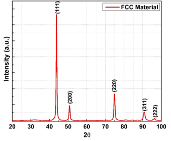
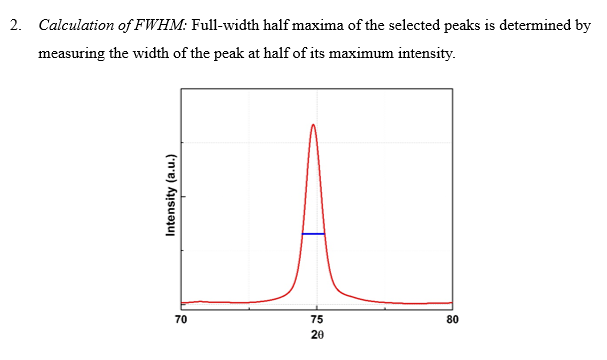

 The following steps are generally used for the estimation of crystallite size 
 1.	Peak identification: from the XRD plot (I Vs 2θ), diffraction peaks are identified and corresponding 2θ values are noted. 
 
  
 
 2. Calculation of FWHM: Full-width half maxima of the selected peaks is determined by measuring the width of the peak at half of its maximum intensity 
 
  
 	Application of Scherrer equation: Using the following equation, crystallite size (D) is obtained by averaging the values of multiple peaks. 
D=Kλ/βCosθ
Where λ is X-ray wavelength, β (FWHM) is in radians, and the value of K (Scherrer constant) varies between 0.62-2.08 (commonly used as 0.9). It may be noted that peak-broadening may arise from instrument due to variation in wavelength, eucentric height, slit size, etc. Therefore, the peak-broadening of the sample must exclude the instrumental peak-broadening while calculating the crystallite size (D) as per the equation: D=Kλ/√(β_measured^2-β_standard^2 ).
