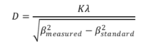

X-ray diffraction (XRD) is a powerful technique for studying the structural properties of metals and alloys. Crystallite size, microstrain and dislocation density can be estimated from the XRD plot (I Vs 2θ). Crystallite size is a key parameter affecting the chemical and physical properties of strain free materials. Scherrer equation is widely used to estimate the crystallite size from XRD data.  
When Xray interact with crystalline material, diffraction occurs as per Bragg’s law: 
nλ=2dsinθ 
Here, n is the order of diffraction, λ is the wavelength of the X-ray, d is the distance between the crystal planes and θ is the angle of incidence. 
<!-- For polycrystalline materials, the small crystallite size and microstrain broaden the diffraction peaks. Generally, the Scherrer equation is utilised to estimate the crystallite size D using broadening of diffraction peaks  -->
For polycrystalline materials, both small crystallite size and microstrain contribute to the broadening of X-ray diffraction peaks. The crystallite size (D) can be estimated from the peak broadening using the Scherrer equation, after correcting for instrumental broadening: 
 D=Kλ / (βCosθ)  
<!--  -->

Here, K is the shape factor (0.9 for spherical particles), λ is the wavelength of the Xray, β is the full-width half maxima (FWHM) of the diffraction peak in radians and θ is the Bragg angle.
